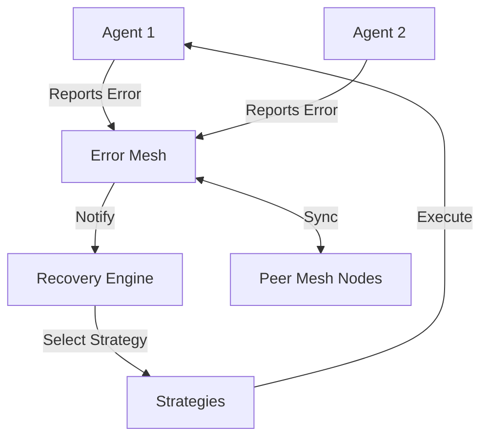

# Agent Error Recovery Mesh

Shared error handling and recovery patterns for AI agent swarms with state synchronization.

## Overview

The Agent Error Recovery Mesh provides a distributed, resilient infrastructure for managing and recovering from errors in multi-agent systems. It ensures that when one agent encounters a failure, the entire swarm can learn from the event, synchronize state, and execute automated recovery strategies.

## Key Features

- **Distributed Error Mesh**: Centralized (but synchronizable) tracking of all agent errors with severity levels and metadata.
- **Automated Recovery Engine**: Pluggable recovery strategies with automated execution based on error codes.
- **State Synchronization**: Peer-to-peer state sharing to ensure all nodes have a consistent view of the swarm's health.
- **Resilient Patterns**:
  - Exponential backoff with jitter for retries.
  - Periodic health monitoring.
  - Conflict resolution for distributed state merging.
- **Ready-to-use Strategies**:
  - Token refresh for authentication failures.
  - Endpoint failover for network timeouts.
  - Service restart for critical crashes.
  - Cache clearing for corrupted states.

## Architecture



## Installation

```bash
bun install
```

## Usage

### Running the Demo

To see the error recovery mesh in action:

```bash
bun run src/index.ts run
```

### Basic Implementation

```typescript
import { ErrorMesh } from "./core/ErrorMesh";
import { RecoveryEngine } from "./core/RecoveryEngine";

const mesh = new ErrorMesh();
const engine = new RecoveryEngine(mesh);

// Register a custom recovery strategy
engine.registerStrategy("NETWORK_TIMEOUT", {
  name: "RETRY_WITH_DELAY",
  execute: async (error) => {
    // Custom recovery logic
    return true;
  }
});

// Report an error
mesh.reportError({
  agentId: "my-agent",
  code: "NETWORK_TIMEOUT",
  message: "Connection lost",
  severity: "HIGH",
  context: { url: "https://api.example.com" }
});
```

## Development

### Running Tests

```bash
bun test
```

## License

MIT
